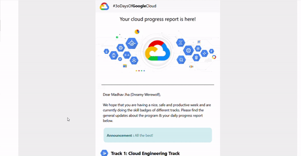

# #30DayGoogleCloud

<p align="center">
        <a href="https://events.withgoogle.com/30daysofgooglecloud/#content" target="_blank"></a>
</p>

## what is #30DayGoogleCloud ?

30 Days of Google Cloud program will provide you an opportunity to kickstart your career in cloud and get hands-on practice on Google Cloud - the tool that powers apps like Google Search, Gmail and YouTube.

## How can this project help you ?

To make things more fun and informative, this project will help **Facilitators** and **Participants** with *leaderboard* and *progress report mails*.

**Leaderboard** will update by `github workflow`, therefore no manual work needed, just set it up once all the participants can enjoy the *leaderboard*

Let's see how to set this project up :

### Step 1: setup
1. Give this repo a 🌟 😛 
2. Fork this repo
3. Clone it to your favorite code editor and run
```bash
npm install
``` 

### Step 2: get and filter data

To all the facilitator google provides a sheet with participants data, since it contains **private data** such as email. We have not included it to the repo.

1. Convert the `excel sheet` to `json`, you can use [online tools](https://csvjson.com/)
2. Run
```npm
npm setup
```
once done you will find `refineData\rawParticipantsData.json`, paste the json data there

It should look something like this
```text
[
    ...
    {
        "Student Name": "name",
        "Institution": "Institute",
        "Enrolment Date & Time": "Date",
        "Enrolment Status": "All Good || not",
        "Student Email":"participant email",
        "Qwiklabs Profile URL": "profileLink",
        "# of Skill Badges Completed in Track 1": 0,
        "# of Skill Badges Completed in Track 2": 0
    }
    ...
]
```
3. Once you have pasted the raw data run
```npm
npm run 1.RefineData
```
This will collect only necessary for our leaderBoard and discard `email` and such.
It will create `participants.json` in the root folder.

### Step 3 (optional): wanna have a nickname ? 🤔

1. If you want to avoid making even names public on the leaderBoard you can use
```npm
npm run 2.GenerateNicknames
```
This will generate **Pseudo names** for all participants, you can share them privately via emails and keep the data confidential.

> 🛑 **Above (1-3)steps are meant to be run only once**: running them more than that can result in confusion with nicknames and such

### Step 4: Making leaderBoard

Now that we have successfully filtered our data, run :
```npm
npm run 3.GetData
npm run 4.MakeLeaderBoard
```
with this you have your leaderBoard ready
try opening the `index.html` file in root folder

### Step 5: what about updating it ?

Manually updating the **LeaderBoard** is a hassle and a waste of time.
Let's make use of `Github workflow` for this.

1. Make folder `.github/workflows` if you don't have already
2. Make a file named `update-leaderBoard.yaml`
3. Paste the following code
```yaml
name: Update leaderBoard data
on:
  schedule:
    - cron: '0 */6 * * *'

  # Allows you to run this workflow manually from the Actions tab
  workflow_dispatch:

# A workflow run is made up of one or more jobs that can run sequentially or in parallel
jobs:
  build:
    # The type of runner that the job will run on
    runs-on: ubuntu-latest

    steps:
      - uses: actions/checkout@v2
      - name: Setup node 12
        uses: actions/setup-node@v2
        with:
          node-version: 12.x
      - run: |
          npm install
          npm run 3.GetData
          npm run 4.MakeLeaderBoard
      - name: Commit and push changes
        run: |
          git config --global user.name "jhamadhav"
          git config --global user.email "contact@gmail.com"
          git add -A
          git commit -m "Leaderboard Updated"
          git push

```
This will update the leaderBoard automatically 4 times a day.

🥳🎊 **Our leaderBoard is ready!!** 🎊🥳

## Progress report mail

Hurray! we have are LeaderBoard up and running, but how about we send all the participants a progress report mail, something tailored for each of them with how they are progressing in this 30Day program.

### Step 1: 

To do so, in the folder `./progressMailReport/cred.js`, in `cred.js`add emails and password.

### Step 2: 

Since we will be sending mails using `Nodemailer` that will use your email add the following
```js
const cred = [

    {
        "user": "your email",
        "pass": "password"
    },
    {
        "user": "another email",
        "pass": "password"
    }

]
module.exports = cred
```
You can add as many emails as to want, to lower the burden of sending mails as `gmail` has a limit of `100` mails per/day.

### Step 3: 
Now all that is left is to send mails, run:
```npm
npm run sendMailReport
```

🎉We can now send report mails!!

> This has to be run **manually** since we can't have participants data in public repo.

## Sample progress report mail

<p align="center"></p>

## Bugs

If you are experiencing any bugs, don’t forget to open a [new issue](https://github.com/jhamadhav/30DayGoogleCloud/issues/new).

## Liked it?

Hope you liked this project, don't forget to give it a star ⭐.
